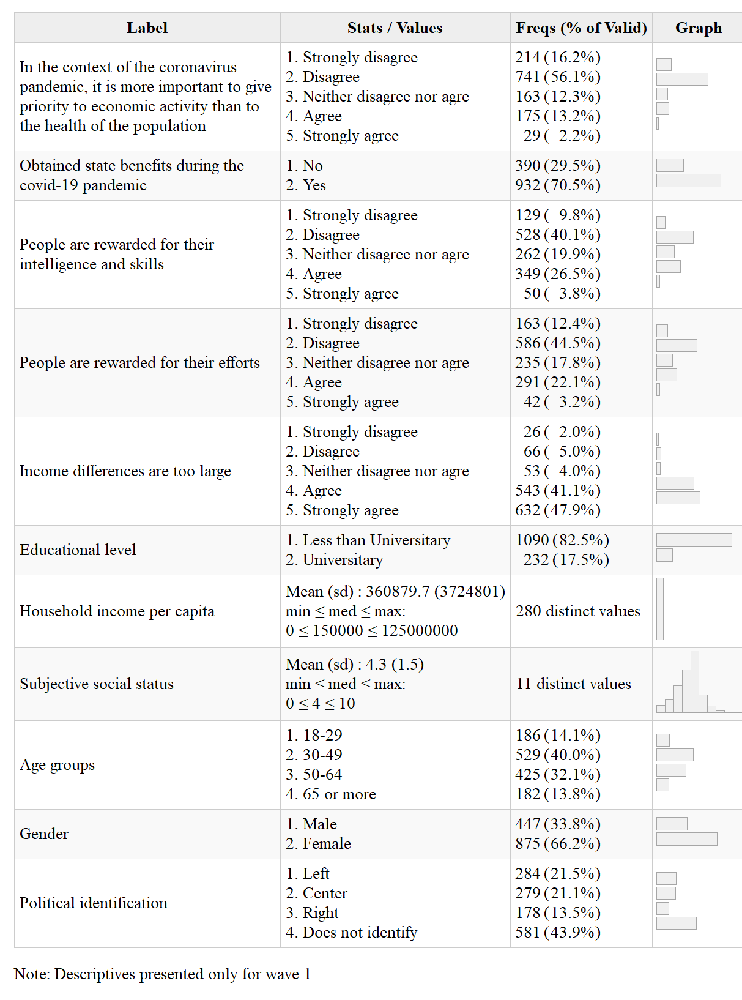
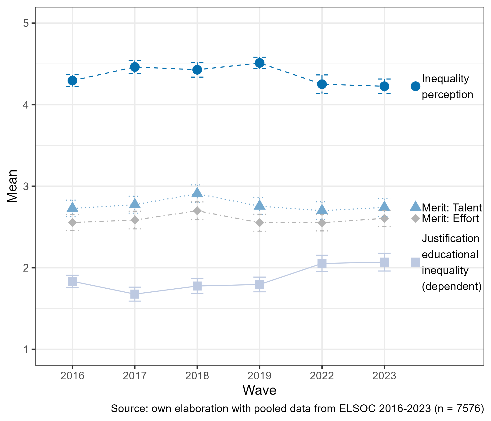

```{r eval=FALSE, include=FALSE}
 # for render in pdf run rmarkdown::render_site("docs/paper.Rmd", output_format = "all")
 # clean #in the yml
 rmarkdown::render("paper.Rmd", output_format = "bookdown::pdf_document2")
 rmarkdown::render("paper.Rmd", output_format = "bookdown::html_document2")
 rmarkdown::render("paper.Rmd", output_format = "bookdown::word_document2")
```
 
```{r setup, include=FALSE}
 knitr::opts_chunk$set(echo=FALSE, warning = FALSE,message = FALSE, cache = TRUE,out.width = '85%',fig.pos= "H", fig.align = 'center')
 # knitr::opts_knit$set(base.url = "../") #relative path for .html output file
 # knitr::opts_knit$set(root.dir = "../") #relative path for chunks within .rmd files
 options(scipen=999)
 options(kableExtra.auto_format = FALSE)
 rm(list=ls())
 options(knitr.kable.NA = '')
 options(knitr.graphics.error = FALSE)
 Sys.setlocale("LC_ALL", "ES_ES.UTF-8")
```


\pagebreak

# Acknowledgments

The authors recognize the support of ANID/FONDECYT grant 1160921; the Center for Conflict and Social Cohesion Studies (COES) grant ANID/FONDAP 1513009; and Millenium Nucleus on Digital Inequalities and Opportunities (NUDOS) NCS2022_046

\pagebreak


# Introduction

Despite the widespread recognition of education as a key factor for social mobility and equality of opportunities, disparities in this domain are far from being eliminated. As the last PISA Report points out, “Socio-economically disadvantaged students are seven times more likely than advantaged students to score below Level 2 in mathematics on average across OECD countries” [@oecd_pisa_2023]. Furthermore, empirical evidence from social science research has revealed an exacerbation of educational inequalities across various domains, such as family socioeconomic status, gender, ethnicity, and migratory background, particularly after COVID-19 [@darmodyImpactsCOVID19Control2021]. Nevertheless, and despite the consistent empirical evidence on educational inequalities and their consequences, research on distributive justice indicates remarkable individual differences in the justification of unequal access to education [@leeFairnessPerceptionsEducational2023]. In the present paper, we argue that the perception of meritocracy in society might play a role in the justification of economic inequalities in this particular domain. 

Meritocracy is defined as a distributive system where individual factors such as effort and talent are conceived as the main determinants of individual performance, usually sidelining the role of opportunities and social background. In recent years, there has been a growing interest in studying meritocratic beliefs as well as their variations according to individual and contextual variables [@mijs_paradox_2021; @mijs_belief_2022]. This line of research has highlighted how meritocratic beliefs are associated with justifying unequal access to resources and rewards in society, by legitimizing social hierarchies in which those who already have resources and advantages are more likely to succeed [@sandel_tyranny_2020;@mcnamee_meritocracy_2004;@hadjar_meritokratie_2008]. Within this framework, this study focuses on the changes in the justification of inequalities in access to education in Chile, and to what extent this phenomenon is associated with the perception of meritocracy and its variations during the COVID pandemic.

The Chilean case is particularly relevant when it comes to the study of inequalities in education. The country is characterized by a high level of economic inequality associated with the privatization and commodification of several social policy domains, among them the educational system [@bellei_estudio_2013; @corvalanMercadoEscolarLibertad2016]. The neoliberal reforms implemented during and since the military dictatorship (1973-1989) have deepened educational policies based on private subsidies, achievement incentives, selection, and segregation [@joikomujicaCuasimercadoEducativoChile2019]. Previous research in Chile has emphasized the concept of an "educational market" [@corvalanMercadoEscolarLibertad2016], characterized by selection, competition, and the provision of goods and services associated with payment capacities. Many studies have addressed this problem from economic, political, and sociological perspectives, generating relevant evidence on their academic and social consequences [@ramosarellanoEducacionPromesaIncumplida2022]. Likewise, massive social mobilizations in the country (particularly in 2006, 2011, and 2018) have had educational inequalities as one of the main targets, putting pressure on governments towards a series of reforms that have advanced free higher education reforms and have diminished the role of private actors in the educational system.

This research endeavors to dissect the nuanced alterations in the justifications for educational disparities within the Chilean framework. Central to our investigation is the premise that the rationale underpinning these inequalities experiences a significant recalibration during periods of vulnerability and crises, specifically under the unprecedented strains of the global health and economic cataclysm triggered by the COVID-19 pandemic [@hankivsky_introduction_2022;@breznau_welfare_2021]. A pertinent aspect of this discourse is articulated in the works of Mijs [-@mijs_stratified_2016;-@mijs_visualizing_2018], showing the interplay between meritocratic beliefs and the legitimization of disparities, as well as the potential erosion of meritocratic principles amidst crises. Within this framework, we point out that periods of vulnerability (such as the health and economic crisis resulting from the COVID-19 pandemic) could weaken the justification of social inequalities, a change that would be at least in part linked to a challenge of the meritocratic ideals. Furthermore, we suggest that the association between meritocratic perception and inequality justification would be weaker among lower-status groups, as they are the most affected in critical times. 


# Inequality beliefs and the justification of economic inequality

The justification of economic inequalities is a controversial field of study. As equality is usually considered a synonym of justice in common sense, the idea that someone could be willing to justify inequalities seems (in principle) far from what is considerably reasonable. Nevertheless, and as pointed out by Barry, the whole normative discussion in social justice can be conceived as “the defensibility of unequal relations between people” [-@barry_theories_1989, p. 3], whereby empirical research has consistently shown strong variations between individuals and societies regarding inequality justification [@trump_income_2018;@kelley_legitimate_2021;@mijs_paradox_2021]. Both theoretical and empirical approaches have been able to establish a clear difference between inequality and justice, which opens the question of to what extent inequality can be tolerated or even justified.

The field of studies of subjective economic inequality has been extensively developed in the social sciences, particularly in the area of social justice research [@Resh2016]. From a sociological point of view, the works of @kluegelBeliefsStratification1981 can be considered pioneers in framing a research area comprising perceptions, beliefs, and justifications in topics such as inequality of opportunities, poverty, and distributive justice. Theoretically, the authors understand the concept of "beliefs" in a "broad sense to refer to the information (veridical or non-veridical) about a phenomenon that an individual uses as a basis both for inferring other information and for action." [@kluegelBeliefsStratification1981, p. 30]. However, the literature has strained the concept of "beliefs" by more specific distinctions around the individual and structural dimensions of economic inequality. In this regard, @wegenerIllusionDistributiveJustice1987 has suggested that perceptions of social status and reward hierarchy are relative to the observer's status in such hierarchies [@wegenerIllusionDistributiveJustice1987, p. 2]. This approach established that status positions influence how people perceive things _are_ and, in turn, these perceptions anchor how people evaluate this inequality as just or unjust [@jassoJusticeEarningsNew1978]. Additionally, @janmaatSubjectiveInequalityReview2013 has suggested more detailed conceptual distinctions about how people perceive economic inequality _is_, how they believe or prefer it _should be_, and the process of evaluating such differences as fair.

Theoretically, @liebigSociologyJustice2016 establishes three fundamental distinctions in justice attitudes in the field of sociological justice research. First, _order-related attitudes_ refer to individual motives that explain preferences for resource allocation based on the principles of equality, need, or entitlement. Second, _procedural justice attitudes_ account for the degree of acceptance of unfavorable outcomes under conditions in which the procedure under which those decisions were made is considered fair (e.g., opportunities). Finally, they can be _outcome-related attitudes_ related primarily to the economic resources that a person currently obtains and the set of collective commitments associated with possessing those resources (e.g., transfers or taxes). Within this framework, we conceptualize the justification of inequality in the first area of order-related attitudes, as it expresses preferences for resource allocation that can be associated with concepts that reflect different distributive principles [@kluegel_social_1995;@sonhing_merit_2011]

An important finding in the area of order-related attitudes is that beliefs about inequality are stratified by social status [@janmaatSubjectiveInequalityReview2013; @kluegelBeliefsInequalityAmericans1986]. The evidence suggests that advantaged positions in terms of socioeconomic status, such as income, education, or occupational prestige, are associated with preferences for less egalitarian class imageries [@Evans1992;@Evans2017] and greater justification of salary gaps [@hadler_why_2005;@kelley_legitimate_2021]. Nevertheless, and in contrast to this perspective, it has been argued that human beings are intrinsically motivated to justify the system they inhabit, even when the information available to them points in the opposite direction [@jost_psychology_2003;@vandertoorn_twenty_2014]. Individuals would be generally disposed to justify the economic status quo regardless of self- and group economic interest because their support partially depends on their beliefs in system-justifying ideologies [@trump_when_2020]. As a result, what has been suggested is that low-status might perceive the status quo as just as they are more strongly attached to dominant ideologies, while high-status individuals are more prone to justify the system to a greater extent because it favors their interests and dominant position [@jost_theory_2020]. 

Another factor that has been linked to inequality beliefs is the perception of economic inequality [@kelleyLegitimationInequalityOccupational1993; @osberg_fair_2006;@castillo_perception_2022]. Studies in this matter have argued that perceived economic inequality functions as an anchor for the justifications of inequality because if these inequalities are indeed seen as fair in their generative processes, then they will be considered as just [@wegenerIllusionDistributiveJustice1987; @Wegener1990]. Thus, both the role of social status and economic inequality perceptions have found support in correlational [@Castillo2012a_justice;@schroder_income_2017], as well as in experimental studies that have manipulated inequality perception [@iturra_percepcion_2023;@trump_income_2018]. In addition, normative or value-driven mechanisms can also explain to what extent people justify inequality. For instance, studies suggest that justice ideologies such as individualism or egalitarianism can mediate the influence of individual status on income inequality justification [@Castillo2011]. Likewise, system justification ideologies can strengthen the influence of socioeconomic status on economic inequality preferences [@garcia-sanchez_creencias_2022]. Altogether, these studies have shown that not only socio-structural factors influence what people believe regarding the distribution of economic resources, but their normative stances and perceptions can also determine preferences for economic inequality in diverse domains.

# The justification of educational inequality 

Studies addressing inequality justification have assessed the support for market ideologies, salary gaps, and distributive preferences. A strand of this research has focused on specific policy areas such as health, pensions, and education,  attending to the degree of justification of market-based access to social services. For instance, @lindhPublicOpinionMarkets2015 found that public support for the market distribution of social services is generally low in most countries, implying that most people believe it is unfair for market forces to determine access to basic social services. Similarly, @busemeyer_welfare_2020 shows that high-income citizens are less supportive of expanding public spending on universal benefit schemes. Instead, they tend to prefer a public basic insurance scheme, even if it provides relatively more benefits to low-income individuals.

The study of inequality justification in the sphere of education is a rather specific and unattended field. Most studies on educational inequality relate performance indicators (such as grades and standardized test results) to stratification-related variables, whereby few refer specifically to if and how individuals tolerate and even justify educational inequalities. This is probably because in principle it seems counter-intuitive to think that someone would be willing to justify differences in such a sensitive area. This paradox is phrased by @confortiLegitimationInequalityAmerican1992 as “while equality is embraced as a value, inequality is accepted as a reality” (p.230).

In the area of empirical studies, the operationalization of educational inequality justification in terms of questionnaire items is diverse, and there is not a single instrument or scale dedicated specifically to this concept. Rather, some attitudinal surveys usually include education-related items that are posteriorly used as dependent or independent variables. Some examples are ISSP (_Is it just or unjust – right or wrong – that people with higher incomes can buy better education for their children than people with lower incomes?_), and the ESS 2018 (_Compared to other people in [country], I have had a fair chance of achieving the level of education I was seeking_). Although both questions have been used to measure the justification of educational inequality, they refer to different aspects. The ESS can be classified as reflexive, as the respondent is involved as a referent for the question, whereas the ISSP question is non-reflexive. Furthermore, ISSP refers to educational access, while the ESS refers to educational outputs.

Studies have addressed the justification of educational inequality from different conceptual perspectives and methodological strategies. Some perspectives emphasize the justification of differences between specific groups, finding for instance that Americans are more concerned about—and more supportive of proposals to close—wealth-based achievement gaps than Black-White or Hispanic-White gaps [@valantPoliticsAchievementGaps2016]. Other studies focus on the association between status differences and inequality justification in education, based on the rational premise that those who are worst-off would tend to show lower levels of justification [@stoilovaFairnessEducationalOpportunities2023]. However, most of the research in this area goes beyond status differences, focusing on how subjective factors such as perceptions and beliefs are related to different levels of justification.

The perception of economic inequality is one of the factors associated with the justification of educational inequality. As pointed out by @janmaatSubjectiveInequalityReview2013, justifications are usually confused under the labels of “beliefs” and “attitudes,” and their distinction from perceptions is relevant as it helps state that justifying a certain level of inequality requires taking into account which level of (perceived) inequality is first and foremost being recognized [@sonhing_merit_2011;@castillo_multidimensional_2023]. For instance, a recent study by @dayPerceivedIdealInequality2023 on the perception and justification of inequality in university endowments in the U.S. points out that individuals tend to underestimate the magnitude of existing inequality while simultaneously desiring greater equality. Furthermore, through an experiment, they demonstrate that information about inequality in university endowments (i.e., manipulating inequality perception) increases the perception of injustice in education. Results of this study are in line with the consistent evidence on biases related to the undersetimation of economic inequality [@castillo_perception_2022;@gimpelson_misperceiving_2018]

Besides focusing on the relationship between perception and justification of educational inequality, another group of studies has addressed how the justification of inequality is associated with the support of different distributive principles. In an experiment by @igliozziFairShareEffects2024, they establish how the support for different justice principles (equity, equality, and need) is related to support for redistributive policies in domains such as education. They find that a larger system justification  [@jost_psychology_2003] is related to higher support for the principles of equity and equality (over need) in distributing educational outcomes, where equity was measured in terms of access to education related to performance ('Students who place within the highest 50% of testing scores from the previous year can attend the magnet school'). In the same line, @leeFairnessPerceptionsEducational2023 show that performance assessments (in what they call “neoliberal orientations”) predicted people's fair perceptions of educational inequality.

_Justificacion, inequality and meritocracy in the educational domain_

The relationship between performance and outputs brings us to the concepts of merit and meritocracy, key in educational justice research. The concept of meritocracy, coined by sociologist Michael Young in his satirical work "The Rise of the Meritocracy" [-@young_rise_1962], has a rich history and multifaceted meaning. Young's term was initially used to critique a hypothetical future society where social and economic positions were entirely determined by individuals' merits, talents, and efforts, ostensibly eliminating the influence of inherited privilege. However, over time, the term has evolved to describe a social system where advancement and success are perceived as directly linked to one's abilities and achievements, sidelining inequalities of opportunities [@bell_politics_2020]. This would contribute to justification of inequality in the educational domain [@sandel_tyranny_2020], as individual ability is often inherited, and educational attainment is influenced by family background [@goldin_meritocracy_2000].

Empirical research examining the relationship between meritocratic perceptions and the justification of educational inequality provides valuable insights into the dynamics shaping individuals' attitudes and beliefs. Some studies have explored the extent to which people believe that educational systems are meritocratic and how these perceptions influence their acceptance or rejection of educational disparities, as well as status differences [@McCoy2007]. This belief is particularly influential in educational institutions, where it not only encourages academic success but also legitimizes social and income inequality [@batruch_belief_2023]. Most of the evidence so far suggests that those who believe in a direct link between effort, talent, and educational success are more inclined to rationalize existing disparities in educational outcomes. However, empirical findings also reveal nuances in this relationship. For instance, studies show that when individuals perceive structural barriers, such as economic disparities or discrimination, as hindering the meritocratic ideal, they may be less likely to justify educational inequalities [@dayPerceivedIdealInequality2023]. This suggests that while meritocratic beliefs play a significant role, individuals' awareness of broader societal issues can mediate their willingness to rationalize educational disparities.

_This study_

The present research uses longitudinal survey data from 2016 to 2022 to asses changes in inequality justification. As there are measures before and after the COVID pandemic, firstly we explore to what extent it is possible to identify variations in inequality justification in this time frame. Although we are aware that it is not possible to make a causal claim given that this period is characterized by many other circumstances besides COVID, we argue that the increase of risk perceptions in critical situations (such as the pandemic) impacts public concerns about equality and redistribution [@breznau_welfare_2021]. Although the pandemic might have triggered such concerns mostly regarding health, we believe that other policy areas, such as education, could have been impacted in this period. Consistently, our first hypothesis is: 

$H_1$: The justification of educational inequalities decreases after the pandemic

Our second argument is based on the evidence that relates rational interests with justifications and preferences [@hing_failure_2019], expecting that:

$H_2$: Those with lower status characteristics show lower justification of educational inequalities

Thirdly, we address inequality perception. As referred to above, the justification of inequality requires, first and foremost, that such inequality is recognized. As a larger inequality in this domain threatens a basic equality ideal, the corresponding hypothesis in this case is:

$H_3$: A larger inequality perception is negatively associated with the justification of educational inequalities.

Our fourth hypothesis refers to the central concept of meritocracy. As meritocracy justifies inequalities based on performance, we expect that:

$H_4$: Higher meritocratic perceptions are positively related to the justification of educational inequalities.

Finally, and in line with hypothesis 1 and 4, we explore interactions between meritocracy and inequality justification over time. As COVID-19 pandemic has affected the structural opportunities to attend schools, universities, or workplaces, the ideal of meritocracy might have been challenged. As a consequence, the justification of inequality could show a decrease over time:

$H_5$: The positive association between meritocracy and inequality justification mitigates along time

#  Data, variables & methods

## Data

The main data source is the Chilean Longitudinal Social Survey 2016–2022. The ELSOC has been designed as a yearly panel study to evaluate how individuals think, feel, and behave regarding a set of social issues concerning conflict and social cohesion in Chile. The sampling design is probabilistic, stratified, clustered, and multistage. It provides adequate coverage of the country's largest cities (Metropolitan Area of Santiago, Valparaíso, and Concepción) and smaller cities. Consequently, the ELSOC comprises a total of 2,927 participants aged between 18 and 75 years in wave 1. In addition, the sample represents 77% of the total national population and 93% of the urban areas [@elsoc_estudio_2022].

The survey has been conducted yearly since 2016, except for the year 2020, when it was suspended due to the pandemic. The waves 2016,2017,2018,2019 and 2022 were administered using computer-assisted personal interviewing (CAPI). However, in 2021 a reduced version was conducted using computer-assisted telephone interviews (CATI). In addition, wave 3 included a refreshment sample to counter survey attrition. The same sampling strategy as that of wave 1 was implemented for selecting new cases. As a result, the total sample of wave 3 included 3,748 cases, of which 2,229 were part of the original sample and 1,519 were from the refreshment sample. The data from the refreshment sample is not included in the analytical sample because we wanted to analyze longer response trends. Regarding the original sample, the response rate was 62.4% in wave 1, achieving N = 2,927 participants. In broader terms, the accumulated attrition between Wave 1 and Wave 6 is 41%, achieving a final sample of N = 1728. The analysis used longitudinal weights to avoid bias due to the sampling design, allowing us to control for biases arising from systematic patterns of non-participation in the survey after the first wave. For a more detailed analysis of responses, attrition, and the construction of longitudinal weights, visit https://coes.cl/encuesta-panel/.

## Variables

The main variable of this study is the justification of educational inequality. This item is measured using the following statement:"It is just that high-income people have a better education for their children than people with lower incomes" ("Es justo que las personas de altos ingresos tengan una mejor educación para sus hijos que las personas con ingresos más bajos" in Spanish). Here, the respondents declared their preferences on a Likert scale from "strongly disagree" (1) to “strongly agree.” (5)

The main independent variables refer to meritocratic perception, which is operationalized by two items, one related to effort ("In Chile, people are rewarded for their efforts"), and the other related to talent ("In Chile, people are rewarded for their intelligence and skills"). In addition, we included an indicator for economic inequality perception ("In Chile, the income differences are too large"). All these variables were also measured using a Likert scale from "strongly disagree" (1) to "strongly agree" (5). Then,  educational level and household income quintiles are included as objective status measures, as well as subjective social status. Finally, political identification on a left-right scale, age and gender were included as control variables. Table \@ref(tab:descriptives) shows the items used, their response categories, and their frequency.

```{r descriptives, echo=FALSE, results='asis'}
pacman::p_load(kableExtra)
kable(data.frame(image=''),    # generar tabla
      format="pipe",
             caption="Independent variables",
             col.names = "",
             row.names = F)
```

Figure \@ref(fig:frecuencies) shows the average distribution throughout the years for the dependent and independent variables. We observe that there is a large group (88.2%) of respondents who disagree or strongly disagree that people with higher incomes can access better education. Likewise, a large group of respondents (91.7%) agree or strongly agree that income differences in Chile are too large. On the other hand, there is an important level of disagreement (disagree + strongly disagree) about the perception of meritocracy, this is, whether people are rewarded for their talent (47.6%) and for their efforts (57%).

```{r frecuencies, echo=FALSE, fig.cap = "Frequency of responses for justification of educational inequality, perception of inequality, and perception of meritocracy for all the years analyzed", fig.align='center'}
 knitr::include_graphics("output/graphs/merit_plot.png")
```


## Methods

Given the hierarchical structure of the data (observations nested in survey waves), we applied a longitudinal multilevel strategy [@singer_applied_2009]. Longitudinal multilevel models are suited to account for the shared variance among units in the data to estimate standard errors better. Since individuals share variance within themselves over time, if the error structure is not considered, it would be as if they were considered different individuals. Multilevel models allow a solution in regression estimation by adding a random term that represents the variance associated with the nesting of the data (random effects). The linear multilevel models are estimated using the R library "lme4" [@singer_applied_2009, p.4].

```{r message=FALSE, warning=FALSE, include=FALSE, echo=FALSE}
  #RUN THIS BEFORE THE ANALYSIS
  pacman::p_load(knitr)
  table_format = if(is_html_output()) {
    "html"
  } else if(is_latex_output()) {
    "latex"
  }

  table_format2 = if(is_html_output()) {
    T
  } else if(is_latex_output()) {
    F
  }
```

# Results

```{r alluvial, echo=FALSE, fig.cap = "Change in the justification of educational inequality over time (2016-2022)", fig.align='center'}
 knitr::include_graphics("output/graphs/alluvial_dep.png")
```

Figure \@ref(fig:alluvial) illustrates yearly frequencies in the justification of educational inequality between 2016 and 2022. Each year represents stacked percentual frequencies, and the flows in between represent the within-subjects’ change of opinions from one year to the next, as we are using longitudinal panel data [@rosvall_mapping_2010]. For instance, of the 32.2% who strongly disagreed with inequality justification in 2016, about half of them kept responding the same in 2017, whereas the other half shifted their opinion to other response categories. In general, the large majority - between 80 and 90% - disagrees with the justification of educational inequality throughout the years. Despite this overall tendency, we also observe that the disagreement with inequality justification (disagree + strongly disagree) tends to go down in the last wave. This change is mostly a result of the radical decrease in the lowest response category (strongly disagree), which diminishes to half when compared with previous years. 

```{r means, echo=FALSE, fig.cap = "Change in the mean of justification of educational inequality, perception of inequality, and perception of meritocracy over the years", fig.align='center'}
 
```

Figure \@ref(fig:means) shows the average changes in the main variables considered for this study. Here we observe that the justification of educational inequality has the lowest average throughout the years when compared with the other (independent) variables, whereas the highest average is consistently represented by inequality perception. Interestingly, in the last wave of the study (2022) the justification of inequality increases whereas the perception of inequality decreases. As the merit variables are concerned, they show a very similar pattern in terms of averages and changes over the years, being the perception of meritocracy related to effort always lower than the one associated with talent. 

```{r correlation, echo=FALSE, fig.cap = "Correlation matrix of justification of educational inequality, perception of inequality, and perception of meritocracy for all the years analyzed", fig.align='center'}
 knitr::include_graphics("output/graphs/corr.png")
```

Figure \@ref(fig:correlation) presents a correlation matrix of the main variables analyzed, using data from all survey waves. In this matrix, the correlations vary between low and moderate values. Justification of economic inequality depicts a moderate and negative association with the perception of inequality and a moderate and positive association with both meritocracy perception variables. Regarding the perception of inequality, it presents a moderate and negative association with both meritocracy perception variables. Finally, the two meritocracy variables present a high and positive association with each other.

## Multivariate analysis

Table \@ref(tab:multilevel) shows the multilevel estimation results for the justification of educational inequality. Model 1 includes the survey waves to estimate intertemporal changes in the dependent variable. Taking 2016 as a reference point, we can observe a staggered decrease in 2017 ($\beta$=-0.15, p<.001), 2018 ($\beta$=-0.06, p<.05), and 2019 ($\beta$=-0.07, p<.01). Nevertheless, in the last wave of 2022 there is a radical increase in level of justification of economic inequality ($\beta$=0.21, p<.001), suggesting a non-linear change in this variable. Attempting to model this path of change over time, Model 2 incorporates time (survey waves) as a continuous variable as well as its quadratic term, representing the nonlinear association initially observed in Model 1. On the one hand, the survey wave depicts a negative association, expressing an average decrease in inequality justification over time, but on the other hand, the quadratic wave term is positive, indicating the reversion of this path in the last measurement point.

Model 3 adds the sociodemographic variables, where having a higher income and being older (65 or older compared to 18-29) have a significant and positive influence on the justification of educational inequality. On the contrary, the gender variable has a negative effect, expressing that women on average justify less inequality in education when compared to males. Educational level and subjective social status are not shown in this table for the sake of space (as they do not exhibit significant effects), but the complete estimation of the models is presented in the appendix. Model 3 also includes the control variables, where identifying oneself with the center, right-wing, or when reporting no political identification, has a significant and positive association on the justification of educational inequality - when compared to being left-wing oriented. Inequality perception is added in Model 4, showing a negative association with the justification of educational inequality as hypothesized, remaining stable when controlling for the rest of the variables. 

Models 5 and 6 introduce the meritocratic variables: talent (if intelligence and abilities are rewarded in society) and effort (if efforts are rewarded in society). In line with our hypotheses, the perception that talent is rewarded has a positive influence on the justification of educational inequality in Model 5 ($\beta$=0.04, p<0.01). However, when controlling for the perception that effort is rewarded, this effect is no longer significant. In this sense, Model 6 shows that the perception that effort is rewarded in society is not only positively associated with the justification of educational inequality ($\beta$=0.05, p<0.01), but it has a larger weight than the perception of talent. 

```{r multilevel, echo=FALSE, results='asis'}
pacman::p_load(dplyr,       # Manipulacion de datos
               knitr,
               kableExtra,
               summarytools,
               lme4,
               texreg
               )
load(file = here::here("input/data-proc/df_study_t6_ind_comunas.RData"))

# generate analytical sample
df_study1 <- 
  df_study_long_t6_comunas %>%
  select(idencuesta,ola,comuna, ponderador_long_total,just_educ, des_perc, merit_effort, merit_talent, education=educ,quintil1:sexo) %>% 
  na.omit() %>% 
  mutate(ola = as.factor(ola),
         ola_num = as.numeric(ola),
         ola_2=as.numeric(ola)^2,
         sexo=as.factor(sexo)
         )
# Hipotesis
h0 <- "ola"
h1 <- "ola_num+ola_2"
h2 <- "ola_num+ola_2+education+quintil1+ess+edad+sexo"
h3 <- "ola_num+ola_2+education+quintil1+ess+edad+sexo+pos_id"
h4 <- "ola_num+ola_2+education+quintil1+ess+edad+sexo+pos_id+des_perc"
h5 <- "ola_num+ola_2+education+quintil1+ess+edad+sexo+pos_id+des_perc+merit_talent"
h6 <- "ola_num+ola_2+education+quintil1+ess+edad+sexo+pos_id+des_perc+merit_talent+merit_effort"

# A. Education distributive justice
educ.null <- lmer(formula(paste0("just_educ~","1 + (1|idencuesta)")),data = df_study1, weights = ponderador_long_total)
educ0 <- lmer(formula(paste0("just_educ~",h0,"+(1|idencuesta)")),data = df_study1, weights = ponderador_long_total)
educ1 <- lmer(formula(paste0("just_educ~",h1,"+(1|idencuesta)")),data = df_study1, weights = ponderador_long_total)
educ2 <- lmer(formula(paste0("just_educ~",h2,"+(1|idencuesta)")),data = df_study1, weights = ponderador_long_total)
educ3 <- lmer(formula(paste0("just_educ~",h3,"+(1|idencuesta)")),data = df_study1, weights = ponderador_long_total)
educ4 <- lmer(formula(paste0("just_educ~",h4,"+(1|idencuesta)")),data = df_study1, weights = ponderador_long_total)
educ5 <- lmer(formula(paste0("just_educ~",h5,"+(1|idencuesta)")),data = df_study1, weights = ponderador_long_total)
educ6 <- lmer(formula(paste0("just_educ~",h6,"+(1|idencuesta)")),data = df_study1, weights = ponderador_long_total)

# Table 1: individual

omit <- "(education)|(ess)"
texreg::texreg(list(educ0, educ1, educ3, educ4, educ5, educ6),
                custom.note = "*** p < 0.001; ** p < 0.01; * p < 0.05.
Note: Model 3 to 6 are controlled by educational level, and subjective social status with no significant effects.", 
                omit.coef = omit,
                custom.coef.names = c("Intercept",
                                      "Wave 2017",
                                      "Wave 2018",
                                      "Wave 2019",
                                      "Wave 2022",
                                      "Wave",
                                      "Wave^2",
#                                      "High School <br> <i>(Ref. Primary)</i>",
#                                      "Technical",
#                                      "Universitary",
                                      "Quintile 2",
                                      "Quintile 3",
                                      "Quintile 4",
                                      "Quintile 5",
                                      "Quintile NA",
#                                      "Subjective Social Status",
                                      "Age 30-49",
                                      "Age 50-64",
                                      "Age 65 or more",
                                      "Gender (Ref. Male)",
                                      "Center",
                                      "Right",
                                      "Does not identify",
                                      "Inequality perception",
                                      "Merit: Talent",
                                      "Merit: Effort" ),
                groups = list("Wave (Ref.= Wave 2016)" = 2:5,
                  "Quintile (Ref.= Quintile 1)" = 8:12,
                  "Age (Ref.= 18-29)" = 13:15,
                  "Pol. pos (Ref.= Left)" = 17:19
                  ),
                include.loglik = FALSE,
                include.aic = FALSE,
                custom.gof.names = c("BIC",
                                     "Num. obs.",
                                     "Num. groups: Individuals",
                                     "Var: Individuals (Intercept)",
                                     "Var: Residual"),
               caption = paste("(\\#tab:multilevel)","Multilevel longitudinal models for the justification of inequality in education"),
               center = TRUE,
               caption.above = TRUE,
               scalebox = 0.765,
               float.pos = "!ht", 
               booktabs = FALSE, 
               use.packages = FALSE, 
               include.rs = FALSE, 
               include.rmse = FALSE,
               include.ci = FALSE)

```

```{r interact, echo=FALSE, results='asis'}
df_study1 <- 
  df_study_long_t6_comunas %>%
  select(idencuesta,ola,comuna, ponderador_long_total,just_educ, des_perc, merit_effort, merit_talent,education=educ,quintil1:sexo) %>% 
  na.omit() %>% 
  mutate(ola = as.numeric(ola),
         ola_2=as.numeric(ola)^2,
         sexo=as.factor(sexo)
 #        edad=as.numeric(edad)
         #pos_id=as.numeric(pos_id)
         )

# Hipotesis

h6 <- "ola+ola_2+education+quintil1+ess+edad+sexo+pos_id+des_perc+merit_talent+merit_effort"
h1b <- "ola+ola_2+education+quintil1+ess+edad+sexo+pos_id+des_perc+merit_talent+merit_effort+merit_effort*ola"
h3b <- "ola+ola_2+education+quintil1+ess+edad+sexo+pos_id+des_perc+merit_talent+merit_effort+merit_talent*ola"

# A. justification educational inequality
educ1 <- lmer(formula(paste0("just_educ~",h1b,"+(ola+merit_effort|idencuesta)")),data = df_study1, weights = ponderador_long_total)
educ3 <- lmer(formula(paste0("just_educ~",h3b,"+(ola+merit_talent|idencuesta)")),data = df_study1, weights = ponderador_long_total)
educ6 <- lmer(formula(paste0("just_educ~",h6,"+(1|idencuesta)")),data = df_study1, weights = ponderador_long_total)

# table 3: interacciones
omit <- "(education)|(ess)|(quintil1)|(edad)|(sexo)|(pos_id)|(des_perc)"
texreg::texreg(list(educ6,educ3,educ1),
                custom.note = "\\item *** p < 0.001; ** p < 0.01; * p < 0.05.
Note: All the models are controlled by educational level, income quintile, subjective social status, age, gender, <br> political position and inequality perception",
                omit.coef = omit,
                include.loglik = FALSE,
                include.aic = FALSE,
                custom.coef.names = c("Intercept",
                                      "Wave",
                                      "Wave^2",
                                      "Merit: Talent",
                                      "Merit: Effort",
                                      "Wave * Merit: Talent",
                                      "Wave * Merit: Effort"
                                      ),
                custom.gof.names = c("BIC",
                                     "Num. obs.",
                                     "Num. groups: Individuals",
                                     "Var: Individuals (Intercept)",
                                     "Var: Residual",
                                     "Var: Individuals Wave",
                                     "Var: Individuals Merit: Talent",
                                     "Cov: Individuals (Intercept) Wave",
                                     "Cov: Individuals (Intercept) Merit: Talent",
                                     "Cov: Individuals Wave Merit: Talent",
                                     "Var: Individuals Merit: Effort",
                                     "Cov: Individuals (Intercept) Merit: Effort",
                                     "Cov: Individuals Wave Merit: Effort"),  
               caption = paste("(\\#tab:interact)","Interaction effects for the justification of economic inequality"),
               center = TRUE,
               caption.above = TRUE,
               scalebox = 0.765,
               float.pos = "!ht", 
               booktabs = TRUE, 
               use.packages = FALSE, 
               include.rs = FALSE, 
               include.rmse = FALSE,
               include.ci = FALSE,
               threeparttable = TRUE)
```

In this final part of the analysis, we contrast longitudinal hypotheses regarding changes in the relationship between meritocracy and justification of economic inequality over time. In hypothesis 5 we proposed that the association between the perception of meritocracy and inequality justification mitigates over time, as meritocratic ideals could have weakened due to critical situations associated with the COVID pandemic. We test this hypothesis through interaction effects, displayed in Table \@ref(tab:interact). Model 1 is shown as a baseline model, it is the same as Model 6 in Table 1 but it only displays the variables involved in the interaction for the sake of space (all other variables are controlled for). Model 2 adds the interaction between the perception of meritocracy based on talent and time (panel wave), whereas Model 3 does the same but now for the perception of meritocracy related to effort. As observed, only the effort variable shows a significant interaction with the time variable (0.01, p<0.05), meaning that, on average, the association between the perception of meritocracy based on effort and the justification of inequality increases by 0.01 points in every measurement point.

# Discussion and conclusions

Our research sought to examine the relationship between the perception of meritocracy and the justification of inequality in education from a longitudinal perspective amid the health crisis generated by the COVID-19 pandemic. In general, our results showed mixed evidence about our hypotheses. Whereas we find support for the association between the perception of meritocracy and justification of inequality across time, the analyses that involved changes in justification of inequality are against our initial proposal. We argued that in times of crisis, greater exposure to risk due to the health context would result in a lower justification of inequality by citizens. In this regard, longitudinal models showed that the justification of inequality in education is far from being linear, and whereas a decreasing pattern was found between 2017 and 2019, there is a striking increase in the last measurement point (2022), after the peak of the COVID pandemic. As we mentioned at the beginning, given our data limitations it is not possible to attribute such changes only to the pandemic and the related economic and social crises. As in the Chilean case the pandemic period occurred along with a constitutional process, disentangling different forces driving public opinion it becomes difficult and deserves further qualitative and quantitative studies. A closer look to the political environment during the last year in the country could give additional hints. Some recent studies have argued that the election of a far left-wing constitutional assembly during this period generated a backslash effect, mainly due to several scandals that led to the delegitimation of this assembly. This could have driven preferences in a conservative direction, which was actually reflected in the election of a right-wing second assembly after the failed first constitutional process [@palanza_chile_2023;@sazo_chile_2023].

Regarding the status position, our central hypothesis was that individuals in more advantaged situations and with greater resources would tend to defend their interests and justify greater education inequality ($H_2$). In this regard, our results show a positive and robust relationship between income and the justification of inequality, which would align with our original hypothesis based on the rational interests of the better-off that would lead to a larger inequality justification. Besides status, we also considered inequality perception, as the literature on attitudes toward inequality has argued that a greater justification of inequality is associated with its perceived magnitude ($H_3$). Consistent with this hypothesis, our results showed that, throughout the years, a larger perceived economic inequality motivates a lower justification of inequality in education.

The main focus of this study was on the relationship between meritocracy and justification of inequality, arguing that those who perceive that the society in which they live complies with meritocratic principles, would be more inclined to justify inequality in education ($H_4$). At first look, the results are consistent with the hypothesis; however, some nuances are worth attending concerning different aspects of meritocracy, namely effort and talent. Our results are favorable for the effort dimension but not confirmed for the talent dimension. In other words, the perception of meritocracy in terms of rewarded effort is more relevant in justifying access to education than the perception of talent. This could be explained as that talent could be more associated with luck in terms of random assignment, and in this terms would not be enough reason (as it is effort) to justify educational inequality.

Finally, as our first hypothesis supported, we expected that the relationship between meritocratic perceptions and justification would tend to diminish over time. However, longitudinal evidence shows that the perception of meritocracy linked effort strengthens its relation with the justification of inequality in education, against the temporal change hypothesis ($H_5$). In other words, meritocracy seems to gain force concerning justifying inequality and not the other way around as we expected given the social context in the post-covid era. An alternative interpretation is that in times of high exposure to risk, people tend to stick more to narratives that provide greater security regardless of the rest of the society - such as individual effort-, which might also be accompanied by lower degrees of solidarity to safeguard the well-being of themselves and their surrounding close peers. Again, this certainly needs further studies that include additional specific conceptual and methodological approach to this phenomenon.

Among the limitations of our study, we can mention at least three. First, we know that inequalities in education can manifest themselves in terms of outcomes as well as in areas such as access to social services in education as part of welfare policies. In this regard, the construct that we have captured with our indicator can be framed more in the latter, while the evaluation of justice involved in this process does not consider aspects such as equality of educational opportunities or observable outcomes such as the performance of individual or educational institutions. Second, as it has been established by recent research [@castillo_multidimensional_2023], the perception of meritocracy can be understood through individual attributions regarding effort and talent, but also as a function of structural aspects such as family of origin status or social capital. In this sense, the available measurements restricted us to the use of single indicators for effort and talent, and further research should consider improving the measurement quality in this regard. Finally, there are limitations involving the longitudinal dimension of the data used. Given limitations for data collection during the pandemic, the ELSOC study had to shorten the questionnaire in 2021 and unfortunately the educational justice indicator was excluded in that survey. Consequently, the results about temporal change have to be considered carefully, and further data waves could give us more information in this matter.

The capabilities of the ELSOC longitudinal database are not limited to micro-level estimates. In this regard, thanks to the survey's sampling strategy, it would be possible to make contextual estimates at the municipality level in future studies. For instance, statistical models could include contextual information from administrative data sources, allowing testing for hypotheses that include contextual socioeconomic inequality as well as its dynamics over time.  Furthermore, this dataset could  be used for comparing inequality justification in policy areas besides education, such as in health and pensions. Future studies may shed light on how meritocratic perceptions and beliefs affect differently such areas and their changes over time, which would give relevant hints from social sciences for the discussion about societal and cultural changes as well as their impacts on solidarity and social cohesion.


# References

::: {#refs}
:::

# (APPENDIX) Appendix {.unnumbered}

`r if (knitr::is_latex_output()){ '\\appendix'}` `r if (knitr::is_latex_output()){ '\\section{Appendix}'}`

```{r multilevel-full, echo=FALSE, results='asis'}
df_study1 <- 
  df_study_long_t6_comunas %>%
  select(idencuesta,ola,comuna, ponderador_long_total,just_educ, des_perc, merit_effort, merit_talent, education=educ,quintil1:sexo) %>% 
  na.omit() %>% 
  mutate(ola = as.factor(ola),
         ola_num = as.numeric(ola),
         ola_2=as.numeric(ola)^2,
         sexo=as.factor(sexo)
         )
# Hipotesis
h0 <- "ola"
h1 <- "ola_num+ola_2"
h2 <- "ola_num+ola_2+education+quintil1+ess+edad+sexo"
h3 <- "ola_num+ola_2+education+quintil1+ess+edad+sexo+pos_id"
h4 <- "ola_num+ola_2+education+quintil1+ess+edad+sexo+pos_id+des_perc"
h5 <- "ola_num+ola_2+education+quintil1+ess+edad+sexo+pos_id+des_perc+merit_talent"
h6 <- "ola_num+ola_2+education+quintil1+ess+edad+sexo+pos_id+des_perc+merit_talent+merit_effort"

# A. Education distributive justice
educ.null <- lmer(formula(paste0("just_educ~","1 + (1|idencuesta)")),data = df_study1, weights = ponderador_long_total)
educ0 <- lmer(formula(paste0("just_educ~",h0,"+(1|idencuesta)")),data = df_study1, weights = ponderador_long_total)
educ1 <- lmer(formula(paste0("just_educ~",h1,"+(1|idencuesta)")),data = df_study1, weights = ponderador_long_total)
educ2 <- lmer(formula(paste0("just_educ~",h2,"+(1|idencuesta)")),data = df_study1, weights = ponderador_long_total)
educ3 <- lmer(formula(paste0("just_educ~",h3,"+(1|idencuesta)")),data = df_study1, weights = ponderador_long_total)
educ4 <- lmer(formula(paste0("just_educ~",h4,"+(1|idencuesta)")),data = df_study1, weights = ponderador_long_total)
educ5 <- lmer(formula(paste0("just_educ~",h5,"+(1|idencuesta)")),data = df_study1, weights = ponderador_long_total)
educ6 <- lmer(formula(paste0("just_educ~",h6,"+(1|idencuesta)")),data = df_study1, weights = ponderador_long_total)

# Table 1: individual

omit <- "(education)|(ess)"
texreg::texreg(list(educ0, educ1, educ3, educ4, educ5, educ6),
                custom.note = "*** p < 0.001; ** p < 0.01; * p < 0.05.", 
#                omit.coef = omit,
                custom.coef.names = c("Intercept",
                                      "Wave 2017",
                                      "Wave 2018",
                                      "Wave 2019",
                                      "Wave 2022",
                                      "Wave",
                                      "Wave^2",
                                      "High School",
                                      "Technical",
                                      "Universitary",
                                      "Quintile 2",
                                      "Quintile 3",
                                      "Quintile 4",
                                      "Quintile 5",
                                      "Quintile NA",
                                      "Subjective Social Status",
                                      "Age 30-49",
                                      "Age 50-64",
                                      "Age 65 or more",
                                      "Gender (Ref. Male)",
                                      "Center",
                                      "Right",
                                      "Does not identify",
                                      "Inequality perception",
                                      "Merit: Talent",
                                      "Merit: Effort" ),
                groups = list("Wave (Ref.= Wave 2016)" = 2:5,
                              "Education (Ref.=Primary)"= 8:10,
                  "Quintile (Ref.= Quintile 1)" = 11:15,
                  "Age (Ref.= 18-29)" = 17:19,
                  "Pol. pos (Ref.= Left)" = 21:23
                  ),
                include.loglik = FALSE,
                include.aic = FALSE,
                custom.gof.names = c("BIC",
                                     "Num. obs.",
                                     "Num. groups: Individuals",
                                     "Var: Individuals (Intercept)",
                                     "Var: Residual"),
               caption = paste("(\\#tab:multilevel-full)","Multilevel effects of justification of economic inequality"),
               center = TRUE,
               caption.above = TRUE,
               scalebox = 0.73,
               float.pos = "!ht", 
               booktabs = FALSE, 
               use.packages = FALSE, 
               include.rs = FALSE, 
               include.rmse = FALSE,
               include.ci = FALSE)

```

